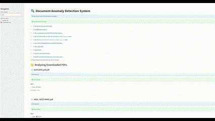

# 🛡️ Threat Intelligence Tool for Business Data Leak Detection

> Detect confidential data leaks in business documents using AI-powered anomaly detection.  
> 🧠 Built with Autoencoders, Isolation Forest, OCR, and SBERT.  
> 🎓 Bachelor’s Thesis | Cybersecurity | Numidia Institute of Technology

---

## 📸 Demo

 <!-- Replace with actual GIF filename -->

> 🖥️ Upload a PDF or auto-scrape web documents  
> 🧠 Analyze sensitive content per-page  
> 🔎 Detect anomalies using trained company-specific models  

---

## 🚀 Features

- 🔍 Semantic anomaly detection with **Autoencoders** & **Isolation Forest**
- 📄 Analyze real-world business PDFs with **OCR and text extraction**
- 🧠 Embeddings via **Sentence-BERT (SBERT)**
- 🌐 **Web scraping** to collect public documents (Scribd, Google)
- 💻 Streamlit-based interactive web app
- 📊 Evaluated on benchmark and Algerian enterprise data

---

## 🧠 Technologies

| Area              | Stack Used |
|-------------------|------------|
| ML & DL           | TensorFlow, Scikit-learn, SBERT |
| NLP               | Sentence-Transformers (all-mpnet-base-v2) |
| OCR & PDF Parsing | Tesseract, PyMuPDF, LangChain |
| Web UI            | Streamlit |
| Scraping          | Selenium |
| Language          | Python 3.12 |

---

## 📊 Datasets 

- 📚 **20 Newsgroups**: Baseline anomaly detection
- 🏢 **Scraped PDFs** from Algerian companies:


---

## 🛠️ Setup & Run

```bash
git clone https://github.com/your-username/midjjnfn.git
cd midjjnfn

# Install dependencies
pip install -r requirements.txt

# Run the app
streamlit run test_4.py
